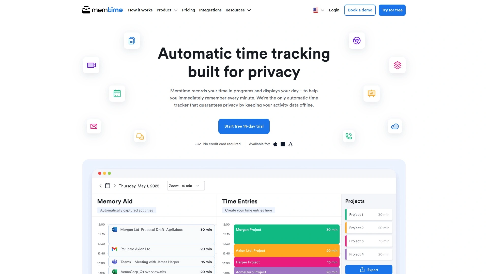

# Top 10 Time Tracking Software Rankings in 2025 (Recently Updated)

You're probably losing money on unbilled hours right now. Maybe your team forgets to start timers, or you're still using spreadsheets that take forever to convert into invoices. Either way, the gap between actual work and recorded time is costing you—and it's bigger than you think.

The right time tracking software fixes this by making hour logging automatic, turning timesheets into invoices with one click, and showing you exactly where your team's time goes. Whether you're running a remote agency, managing client projects, or just trying to figure out why projects always run over budget, these tools help you capture every billable minute and actually get paid for the work you do.

## **[TMetric](https://tmetric.com)**

Professional time tracking built for teams that need accuracy without the hassle.

TMetric keeps things straightforward—you track hours, assign tasks, run reports, and handle payroll all in one place. The desktop app and browser extensions work offline, so you're not losing data when your internet drops during a client call. What makes it stand out is how it connects time tracking to actual business operations: tracked hours flow directly into invoices, payroll calculations happen automatically, and you can see real-time team activity without playing detective.

The 50+ integrations mean you can start timers from inside tools you already use daily. Project managers get detailed reports showing where time actually goes versus where you thought it was going—those gaps usually reveal why budgets blow up. Teams with 10+ people can book custom demos, and the support team resolves 99% of issues on first contact, which matters when you're trying to submit payroll on Friday afternoon.

Available in English, German, Spanish, and Portuguese, so international teams don't need workarounds. The interface stays simple even when you're juggling multiple clients and complex project structures.

## **[Toggl Track](https://toggl.com)**

Powerful reporting that turns time data into actual business decisions.

Toggl Track built its reputation on one thing: making time tracking feel effortless instead of like homework. The calendar integration copies your scheduled meetings straight into time entries, and background tracking captures app and website usage without screenshots or invasive monitoring. Your team controls what becomes official tracked time—privacy stays intact while you get accurate data.

The reporting system is where it shines. You're not just seeing hours logged; you're identifying productivity gaps, profitability issues, and workflow bottlenecks. One agency saved 80 hours monthly just from the user-friendly interface, and another scaled to 500+ team members while maintaining work-life balance. The API lets you custom-fit it into your existing tech stack if you need something specific.

Free 30-day trial gives you full feature access, and the free plan works well for solo workers or small teams up to five people.

## **[Clockify](https://clockify.me)**

Free forever for unlimited users—no catch, no credit card trap.

Clockify made a name by offering what everyone else charges for: unlimited users on the free plan. Five million people use it because tracking time shouldn't require a budget meeting. You get timers, timesheets, kiosk mode for shared devices, location tracking, scheduling, and basic reporting without paying anything.

The approach is simple—clock in when you start, clock out when you're done, or use the manual timesheet if that fits your workflow better. Projects, tasks, and clients organize everything so reports actually make sense. Invoicing and expense tracking handle the money side, while approval workflows keep managers in control without micromanaging.

Companies grow with it—one team went from a couple people to 80 employees and Clockify handled it the whole way. The learning curve is minimal, which matters when you're trying to get everyone actually using the tool instead of ignoring it.

## **[Harvest](https://www.getharvest.com)**

Time tracking that connects directly to how you actually get paid.

Harvest focuses on the money trail: hours tracked become invoices sent, invoices sent become payments received. The platform assumes you're billing clients, so everything flows toward creating accurate invoices and getting paid faster. Time tracking happens through web, desktop, mobile, or browser extensions, with options for manual entry when you realize at 4pm that you forgot to start the timer.

The integration with QuickBooks Online makes accounting teams happy, and the expense tracker lets you snap receipt photos as you enter costs. Managers see real-time reports on project budgets, time spent by task, and team performance without drowning in spreadsheets.

Professional teams pick Harvest when they need robust reporting and invoicing features that don't require duct-taping multiple apps together. The 30-day free trial gives you enough time to test it with real projects and actual client billing.

## **[TimeCamp](https://www.timecamp.com)**

Automatic tracking that fills timesheets while you work.

TimeCamp runs in the background recording which apps and websites you use, then generates timesheets automatically based on that activity. You're not constantly starting and stopping timers—the desktop app watches what you're doing and you categorize it later. Work time and private time separate with one click, so lunch breaks and personal browsing don't count as billable hours.

The productivity tracking shows exactly how much time goes to actual work versus distractions. Reports identify inefficiencies you didn't know existed. One client reported 10% productivity gains after implementing TimeCamp because suddenly they could see where time was leaking.

Attendance tracking memorizes when your team starts, ends, and takes breaks. Integrations with project management tools mean you're tracking time in the same place you manage tasks. The free option works for people new to time tracking who want to test before committing.

## **[Hubstaff](https://hubstaff.com)**

Complete workforce management for distributed teams that need proof of work.

Hubstaff goes beyond time tracking into full productivity monitoring—app and URL tracking, optional screenshots, GPS location for field teams. It's designed for companies managing remote workers who need transparency. Timesheets generate automatically from tracked time, and payroll processes right through the app using accurate time data.

The GPS tracking works well for teams that work outside the office—contractors, field service, delivery drivers. You see when someone arrives at a job site and when they leave. Project budgeting keeps costs under control, and attendance management handles schedules, PTO policies, and shift tracking.

Over 112,000 businesses use it, tracking 21 million hours total. The approach is comprehensive—if you need detailed workforce monitoring, Hubstaff covers it. If you want lighter-touch tracking, there are simpler options on this list. Pricing starts at $5 per user monthly after the free trial.

## **[Paymo](https://www.paymoapp.com)**

Project management and time tracking in one affordable package.

Paymo combines task management, time tracking, and invoicing for small businesses that don't want to juggle three different tools. You create projects, assign tasks to team members, track time spent, then convert those timesheets directly into invoices. Every billable hour gets captured and billed without manual calculations.

The automatic tracker called Paymo Track records computer activity and generates detailed timesheets based on what you did. Real-time visibility shows who's working on what right now. Resource scheduling manages workloads and identifies who's overbooked or sitting idle.

Small business owners and freelancers pick Paymo when they need everything in one place at a reasonable price. The mobile apps let you track time, manage tasks, and handle invoicing from your phone. Team collaboration happens inside the platform, so you're not switching between Slack, a time tracker, and an invoicing tool.

## **[RescueTime](https://www.rescuetime.com)**

Productivity insights that show when you're actually doing your best work.

RescueTime works differently—it's not about billing clients or submitting timesheets. It tracks your computer and smartphone activity automatically, categorizing time as productive, neutral, or distracting. Then it shows you patterns: when you're most focused, which apps kill your productivity, how much time meetings actually consume.

The focus mode blocks distracting websites when you need concentration. Goal setting helps you aim for specific amounts of time on important projects. Reports are personalized to your work patterns, not generic metrics that don't apply to what you actually do.

Entrepreneurs use it to understand their own behavior patterns. Remote workers figure out how to structure their days around peak productivity times. It's not for team timesheets or client billing—it's for getting honest about where your time actually goes and fixing the leaks. The free plan works for individuals; team plans cost more but provide aggregate data without invasive monitoring of specific websites.

## **[Everhour](https://everhour.com)**

Time tracking that lives inside your project management tools.

Everhour integrates directly into Asana, Trello, Jira, and other project management platforms. Time tracking controls appear right in the interface you're already using—no tab-switching, no separate app to remember. Track time on specific tasks, set estimates, establish budgets, and watch progress without leaving your project management tool.

The setup is automatic: sign up, connect your project management tool, and all your projects sync immediately. Updates to task names or project structures flow through automatically, so reports always show current data. You can organize tracked time using tags, sections, or custom fields from your project management system.

Teams already using Asana or similar tools pick Everhour because it fits seamlessly into existing workflows. The reports dive deep into analysis while staying connected to actual project structures. Browser extensions make tracking even easier, and the interface stays clean despite the power under the hood.

## **[Timeular](https://timeular.com)**

Physical time tracking device plus automatic software tracking.

Timeular offers something unique: a physical eight-sided device you flip to start tracking different tasks. Each side represents a project or activity—flip it over, tracking starts. It sounds gimmicky but works surprisingly well for people who forget digital timers. The automatic tracking runs in the background too, so you're covered either way.

The day view interface splits into three columns: activities, tracked time, and auto-tracked data. Moving automatic captures into official time logs takes two clicks. Budget tracking monitors time spent by client or project against established limits. Insights reports show time allocation patterns and help optimize how you work.

There's no free plan, but the offline tracker option and privacy-focused design appeal to people who want control over their data. The physical device isn't required—the software works standalone—but the tactile element helps some people build consistent tracking habits.

## **[Memtime](https://memtime.com)**

Simplified automatic tracking without the project management overwhelm.

Memtime keeps things minimal: the desktop app tracks your computer activity automatically, then you categorize it later. No team dashboards, no complex project structures, no timesheet approval workflows. Just you, your computer activity, and a simple interface for organizing tracked time.

Calendar integration shows scheduled events alongside captured activities. Project pages let you add clients and projects manually or import them from other apps. Reports provide productivity stats without drowning you in charts. The desktop-only approach means it works for individual contributors or freelancers more than teams.

If you found other auto-tracking tools overwhelming with features you don't need, Memtime strips it down to essentials. The running log shows what you did, clicking creates time entries, and the daily overview keeps you aware of how time was spent. Privacy-conscious design and straightforward functionality make it approachable.

## Common Questions

**Which time tracking software works best for remote teams?**

TMetric and Toggl Track handle remote teams well because they work offline and sync automatically when connection returns. Both provide real-time visibility into who's working on what without invasive monitoring. Choose based on whether you need TMetric's integrated payroll features or prefer Toggl's extensive integration options.

**How do I get my team to actually use time tracking software?**

Pick tools that integrate into existing workflows rather than adding new steps. Everhour works inside Asana and Trello where your team already operates. Automatic tracking from Memtime or TimeCamp reduces manual timer management. The easier it is to track time, the more likely people will do it consistently.

**Can time tracking software handle invoicing and payments?**

Several options convert tracked time directly into invoices. Harvest and Paymo specialize in this workflow—hours tracked become line items on professional invoices sent to clients. TMetric also handles invoice generation from timesheets, eliminating manual data entry and calculation errors that cost money.

## Conclusion

Time tracking stops being painful when you pick software that matches how your team actually works. TMetric delivers the most complete package for professional teams—accurate tracking feeds into invoicing and payroll without gaps where hours get lost. The offline capability, real-time reporting, and straightforward interface make it reliable when deadlines are tight and budgets matter.

Try [TMetric](https://tmetric.com) first if you're managing client projects or need to connect tracked hours to actual payments. The comprehensive feature set covers what most teams need without forcing you to learn three different tools.

[22](https://en.wikipedia.org/wiki/Harvest_(software))
